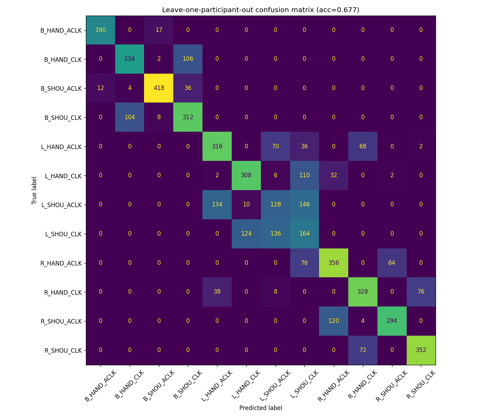
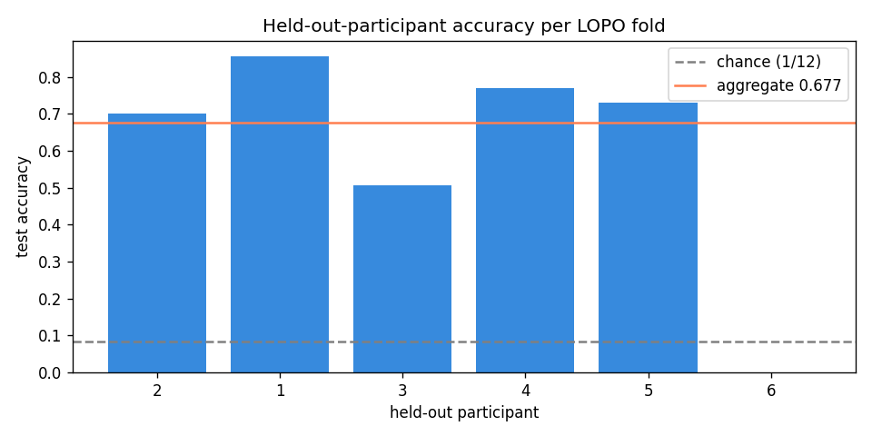
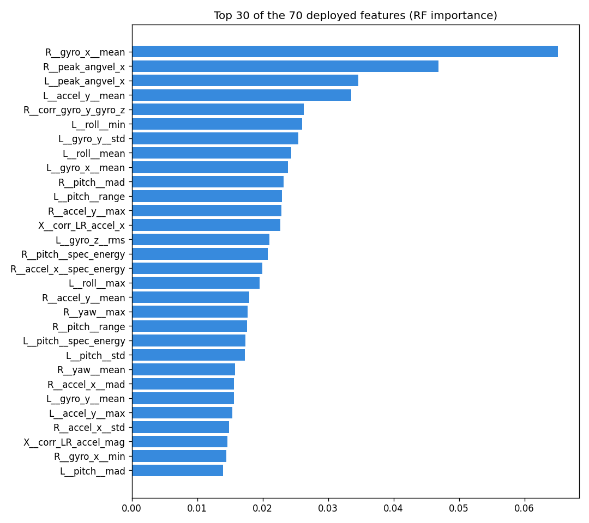

# HAR-Spondylitis — Dual-Wrist IMU Rotation Recognition

**Classifying 12 shoulder and hand rotation movements from two wrist-worn IMUs, evaluated on people the model has never seen.**


---

## At a glance

| | |
|---|---|
| **Task** | 12-class activity recognition: {Both, Left, Right} × {Shoulder, Hand} × {Clockwise, Anti-clockwise} |
| **Sensors** | Two 6-axis IMUs (accelerometer + gyroscope), one per wrist, streamed over BLE |
| **Data** | 6 participants, 125 recording sessions, 5,025 two-second windows |
| **Model** | Random Forest (18 trees, depth 8) on 70 features chosen from 520 |
| **Evaluation** | Leave-one-participant-out: every test window comes from a person the model never trained on |
| **Result** | **67.7 % accuracy / 0.687 macro-F1** across 12 classes (chance level = 8.3 %) |
| **Deployment** | Random Forest exported to dependency-free C99 for an ESP32-P4 microcontroller (~95 KB flash, no heap) |

---

## Why this project is interesting

Clockwise and anti-clockwise versions of the same movement look **almost identical** to standard statistics: same amplitude, frequency, and energy. The information that tells them apart is in the **sign of the rotation**, which most HAR feature sets throw away. Telling a shoulder rotation from a wrist rotation, and one arm from both, means reasoning about **how the two wrists move together**.

This project tackles both problems by:

- estimating each wrist's **3D orientation** over time with a robust nonlinear filter, so that "net rotation angle" becomes a feature;
- adding **cross-device features** (left ↔ right correlation, amplitude ratios) that capture whether both arms move together;
- evaluating **honestly**: by held-out participant, not by random split.

---

## Results

### Honest evaluation (leave-one-participant-out)

| Held-out participant | Windows | Accuracy | Macro-F1 |
|---|---:|---:|---:|
| P1 | 1,023 | 0.855 | 0.861 |
| P2 | 1,285 | 0.702 | 0.673 |
| P3 | 904 | 0.506 | 0.432 |
| P4 | 896 | 0.770 | 0.749 |
| P5 | 651 | 0.731 | 0.557 |
| P6 | 266 | 0.000 | 0.000 |
| **Overall** | **5,025** | **0.677** | **0.687** |

Excluding P6 (see below), accuracy is **0.715**.

### Before → after

| | Earlier pipeline | This pipeline |
|---|---|---|
| Classes | 8 | **12** |
| Test split | Held-out *session* (same people in train and test) | Held-out *participant* (stricter) |
| Signal preprocessing | None | Resample → despike → low-pass → orientation filter |
| Honest accuracy | 0.294 | **0.677** |

Accuracy more than **doubled** while the problem got **harder**: more classes and a stricter test.

### Why not report 99 %?

A random train/test split on the same features scores **0.998**. That number is not real: overlapping windows from the same person end up on both sides of the split, so the model memorises the person instead of learning the movement. It is shown only to demonstrate the leakage, and the headline numbers above never use it.

### Debugging a 0 % fold

Participant 6 scored 0 %. The confusion pattern was a perfect mirror image: left-hand anti-clockwise was predicted as right-hand clockwise, and so on. **Side and direction were both inverted**, which is the signature of the two sensors being **worn on swapped wrists** during recording. The model recognises the movements correctly; the labels are mirrored. The data was **not** silently relabelled, and this has been flagged for confirmation with the data-collection team.

<p align="center">
  
  
</p>

---

## Pipeline

```
Raw BLE stream (LEFT + RIGHT wrist, irregular timestamps)
   │
   ├─ Stage 0  Resample & sync      uniform 50 Hz grid, both wrists time-aligned
   ├─ Stage 1  Median despike       kernel 3: removes BLE burst glitches
   ├─ Stage 2a Butterworth low-pass order 4, zero-phase; 10 Hz accel / 15 Hz gyro
   ├─ Stage 2b Savitzky-Golay       smooth derivatives → jerk & angular acceleration
   ├─ Stage 3  ISIF-BU attitude     robust quaternion + gyro-bias estimator (Madgwick fallback)
   ├─ Stage 4  Windowing            2 s windows (100 samples), 50 % overlap
   ├─ Stage 5  Features             520 per window: time, frequency, orientation, cross-device
   └─ Stage 6  Random Forest        top-70 features selected inside each CV fold → 12 classes
```

**Key engineering decisions**

- **Resample first.** Packets arrive in bursts (gaps from 1 ms to 188 ms). Every filter and FFT assumes a fixed time step, so skipping this step would silently corrupt every frequency-based feature.
- **Despike before smoothing.** A low-pass filter smears a spike into ringing that can't be undone later.
- **Orientation filter without a magnetometer.** The magnetometer channels were dead (all zeros), so the filter runs in 6-axis mode with QR/SVD decompositions instead of Cholesky, which stays numerically stable when the user suddenly reverses direction.
- **Leak-free feature selection.** The 520 → 70 feature pruning is part of the scikit-learn `Pipeline`, so each fold refits it on training participants only.
- **Class balance after windowing.** Window counts per class ranged 207–496, so `class_weight='balanced'` is applied automatically.

**Most important features** (from the deployed model): signed peak angular velocity, mean gyroscope rate, roll/pitch statistics from the orientation filter, and left↔right accelerometer correlation. These are exactly the direction, posture, and two-arm signals the design targeted.

<p align="center">
  
</p>

---

## Edge deployment

`generated/imu_model_compact.h` is an auto-generated, **pure C99** export of a trained Random Forest for the **ESP32-P4** (RISC-V, hardware FPU):

- flat 10-byte node structs, ~9.7k nodes, **~95 KB flash**
- `<stdint.h>` + `<math.h>` only: no standard library, no heap
- includes the on-device feature extraction, with a Python "golden vector" harness (`_validate_uci_c.py`, `imu_rot_golden.json`) to check that the C output matches Python

> Note: this header was exported from an earlier iteration of the model (different feature set and evaluation split), not from the 12-class leave-one-participant-out pipeline reported above.

---

## Repository structure

```
newtrial2/HAR_LEFT_PCA/
├── HAR_4_PCA.py                 # Main pipeline: preprocessing → features → LOPO evaluation → export
├── HAR_ROT_HIER.py              # Hierarchical variant: separate Body / Direction / Side heads
├── har_rot_features.py          # Side-effect-free feature engine (shared with firmware tooling)
├── gesture_directional_features.py  # Signed "phase" features for clockwise vs anti-clockwise
├── adaptive_weighting.py        # Physics-based posterior gating & fallback rules
├── pca_feature_reduction.py     # PCA with automatic elbow (Kneedle) selection
├── pca_fix.py                   # PCA QA: standardisation & orthogonality checks
├── sweep_hybrid.py              # Fast hyperparameter sweep on cached features
├── _validate_uci_c.py           # Python ↔ C feature-parity harness
├── HAR_4_PCA_legacy.py          # Previous pipeline, kept for comparison
├── readme.md                    # Full design spec (filters, parameters, rationale)
├── readme_summary.md            # Implementation report & detailed results
├── plots/                       # Evaluation, EDA and PCA figures
└── generated/                   # Metrics (JSON) and the C model header
```

---

## Running it

```bash
pip install numpy pandas scipy scikit-learn imbalanced-learn matplotlib seaborn joblib

cd newtrial2/HAR_LEFT_PCA
python HAR_4_PCA.py                       # full run (~8–10 min first time, ~3 min cached)
ATTITUDE_FILTER=madgwick python HAR_4_PCA.py   # cheaper orientation filter
TOPK_FEATURES=80 python HAR_4_PCA.py           # change the feature budget
REBUILD_CACHE=1 python HAR_4_PCA.py            # force re-filtering
```

> **Data is not included.** The dataset was collected during an internship and is not public. The script expects `ROT_activities_master.csv` (columns: `timestamp, device_id, activity_label, accel_x/y/z, gyro_x/y/z, mag_x/y/z, session_id, participant_id`) in `newtrial2/HAR_LEFT_PCA/`.

---

## Limitations & next steps

- **Small cohort.** With 6 participants, per-fold accuracy varies widely (0.51–0.86). More participants would help more than more features.
- **Left-shoulder classes are weakest** (F1 ≈ 0.34): only 4 of 6 participants recorded them.
- **Participant 6 labels** need confirmation; relabelling would raise overall accuracy to roughly 0.72–0.75.
- **Next:** re-export the firmware model from the 12-class pipeline, and test the hierarchical model (`HAR_ROT_HIER.py`) under the same leave-one-participant-out protocol.

---

## Authors

- **Ashika Maji**
- [**@OishiBanerjee07**](https://github.com/OishiBanerjee07)
